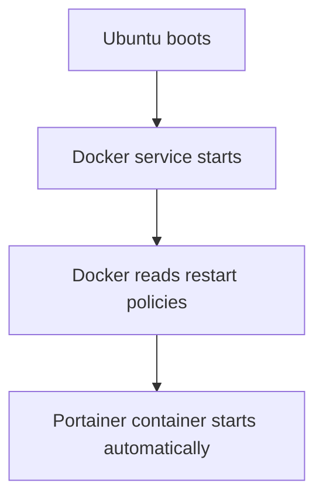

# Ubuntu Media Server Homelab Setup Guide

## Goal

Build a headless Ubuntu Server homelab/media server with:

- Docker
- Docker Compose
- SSH remote management
- Samba (Windows RW shares)
- Plex
- Immich
- Kavita
- Stash
- bitmagnet
- NTFS media disks
- SSD system drive
- Cockpit web UI
- Portainer
- Lazydocker

## Architecture

```text
NVMe SSD (ext4)
├── Ubuntu Server
├── Docker
├── Docker volumes
├── Databases
├── Plex metadata
└── Configs

NTFS HDDs
├── Movies
├── TV
├── Music
├── Books
├── Photos
└── Downloads
```

## Applications, Services, Media Persistence storage

| Purpose       | Storage Type   |
| ------------- | -------------- |
| App configs   | Docker volumes |
| Media library | Bind mounts    |
| Photos/videos | Bind mounts    |
| Databases     | Docker volumes |

## Storage Strategy

| Data Type   | Recommended              |
| ----------- | ------------------------ |
| App configs | `/srv/docker/appname`    |
| Media       | `/mnt/media`             |
| Downloads   | `/mnt/downloads`         |
| Databases   | `/srv/docker/appname/db` |
| Photos      | `/mnt/media/photos`      |


## Steps

### Prepare For Ubuntu Server Installation

#### 1. Prepare Bootable USB Flash Drive

- Download the latest [Ubuntu Server LTS](https://ubuntu.com/download/server?utm_source=chatgpt.com)
- USB Writing Tool (Windows) [Rufus](https://rufus.ie/?utm_source=chatgpt.com)

#### 2. Create Bootable USB

##### Recommended Settings

- Boot Selection: Ubuntu Server ISO
- Partition Scheme: GPT / if no UEFI support MBR
- File System: Leave default. (FAT32)
- Choose: ISO Mode (recommended)

| Setting          | Value          |
| ---------------- | -------------- |
| Ubuntu ISO       | 26.04 LTS      |
| Partition Scheme | GPT            |
| Target System    | UEFI           |
| File System      | FAT32          |
| Write Mode       | ISO Image Mode |


 


#### 3. BIOS Preparation

- Enable:
  - UEFI boot
  - AHCI mode for SATA
 
- Disable:
  - Fast Boot (optional)

#### 4. Install Ubuntu Server

- Tutorials, shell commands, Docker/YAML assume US layout

| Setting              | Value                      |
| -------------------- | -------------------------- |
| Layout               | English (US)               |
| Variant              | English (US)               |
| Installation         | Ubuntu Server (minimized)  |
| Proxy                | Blank                      |
| Use entire disk      | Selected                   |
| Mirror               | Default                    |
| LVM                  | Disable LVM                |
| Encryption (LUKS)    | Leave OFF                  |


##### Final Disk Layout

| Mount       | Type  | Size    |
| ----------- | ----- | ------- |
| `/`         | ext4  | ~1.8 TB |
| `/boot/efi` | FAT32 | 1 GB    |

##### Linux host

| Field       | Value                       |
| ----------- | --------------------------- |
| Your name   | `Piroman`                   |
| Server name | `piroman-server`            |
| Username    | `piroman`                   |

##### ENABLE OpenSSH server

That enables:

- Remote terminal access
- Windows SSH access
- Future Docker management
- Cockpit/Portainer workflow

##### Ubuntu PRO - Skip it

##### SSH Configuration

| Option                                 | Status |
| -------------------------------------- | ------ |
| Install OpenSSH server                 | ✅     |
| Allow password authentication over SSH | ✅     |
| Import SSH key                         |        |


### Connect through SSH to Ubuntu Server

```bash
ssh piroman@192.168.0.246
```


### Initial System Update

```bash
sudo apt update
sudo apt upgrade -y
```


### Remove no longer required packages

```bash
sudo apt autoremove -y
```


### Install Essential Packages

```bash
sudo apt install -y \
curl \
git \
htop \
btop \
tmux \
nano \
ncdu \
ufw \
smartmontools \
ca-certificates \
gnupg \
samba \
ntfs-3g \
cockpit
```

| Package           | Purpose                            | Why You Need It                                  |
| ----------------- | ---------------------------------- | ------------------------------------------------ |
| `curl`            | Command-line downloader/API client | Download scripts, test APIs, fetch files         |
| `git`             | Version control system             | Clone GitHub repos and manage configs            |
| `htop`            | Interactive process monitor        | View CPU/RAM/processes easily                    |
| `btop`            | Advanced terminal resource monitor | Beautiful real-time monitoring dashboard         |
| `tmux`            | Persistent terminal sessions       | Keep sessions running after SSH disconnects      |
| `nano`            | Terminal text editor               | Easy editing of config files                     |
| `ncdu`            | Disk usage analyzer                | Find large folders/files quickly                 |
| `ufw`             | Simple firewall manager            | Secure the server with manageable firewall rules |
| `smartmontools`   | Disk health monitoring             | Check SSD/HDD SMART health status                |
| `ca-certificates` | SSL certificate bundle             | Required for secure HTTPS connections            |
| `gnupg`           | GPG key management                 | Needed for trusted repositories like Docker      |
| `samba`           | Windows file sharing               | Share folders between Ubuntu and Windows         |
| `ntfs-3g`         | NTFS filesystem support            | Read/write Windows NTFS drives                   |
| `cockpit`         | Web management interface           | Manage server from browser                       |


### Configure Firewall

#### First check current firewall status:

```bash
sudo ufw status
```


#### Run the following commands to enable those services

```bash
sudo ufw allow OpenSSH
sudo ufw allow Samba
sudo ufw allow 9090/tcp
```

| Rule       | Purpose                     |
| ---------- | --------------------------- |
| `OpenSSH`  | Allows SSH remote access    |
| `Samba`    | Allows Windows file sharing |
| `9090/tcp` | Allows Cockpit web UI       |


#### Enable firewall

```bash
sudo ufw enable
```


#### Verify firewall status

```bash
sudo ufw status verbose
```


Current state:

| Service          | Status             |
| ---------------- | ------------------ |
| SSH              | Allowed            |
| Samba            | Allowed            |
| Cockpit (9090)   | Allowed            |
| Incoming traffic | Blocked by default |
| Outgoing traffic | Allowed            |


#### Cockpit web management

Open this in your Windows browser: https://192.168.0.246:9090


#### Turn on administrative access in Cockpit


#### Install Docker

```bash
# Install Docker Engine + Docker Compose
sudo apt install docker.io docker-compose-v2 -y

# Enable Docker at startup - Linux equivalent of Windows Services + Startup Type
sudo systemctl enable docker

# Start Docker now
sudo systemctl start docker

# Verify Docker works
sudo docker run hello-world

# Allow your user to run Docker without sudo
sudo usermod -aG docker piroman
```

| Package / Component          | Purpose                       | Why You Need It                                                          |
| ---------------------------- | ----------------------------- | ------------------------------------------------------------------------ |
| `docker.io`                  | Docker Engine                 | Runs containers (Plex, Immich, Kavita, Portainer, etc.)                  |
| `docker-compose-v2`          | Docker Compose plugin         | Lets you define and start multi-container apps using `compose.yml` files |
| `systemctl enable docker`    | Startup service configuration | Makes Docker automatically start after every reboot                      |
| `systemctl start docker`     | Starts Docker service now     | Immediately launches the Docker daemon without rebooting                 |
| `hello-world` container      | Docker test image             | Confirms Docker is installed and working correctly                       |
| `usermod -aG docker piroman` | Adds user to Docker group     | Allows `piroman` to use Docker without typing `sudo` every time          |


Log out of SSH and reconnect. After reconnecting, test:

```bash
docker ps
```
If no permission error appears, Docker is configured correctly.


### Important Concept

On Linux, almost everything important is a service. Examples: Docker, SSH, Samba, Cockpit, Plex, Databases. And all are managed similarly with:

```bash
systemctl
```


### Install Portainer

Portainer becomes your graphical Docker management UI. You’ll be able to:

- Start/Stop Containers
- View logs
- Manage stacks
- Update containers
- Inspect networks/volumes
- Deploy compose files visually

#### Create Docker-managed persistent storage volume for Portainer

A Docker-managed persistent storage volume is permanent storage that is separate from the container itself. It keeps application data safe even if containers are updated, recreated, restarted, or deleted, ensuring settings, databases, and configurations persist independently of the running container.

A Docker container is the running application instance itself — temporary and replaceable — while a Docker volume is persistent storage that holds the application’s important data, such as configurations, databases, and files. Containers can be recreated at any time, but volumes preserve the data independently, so nothing important is lost.

Docker stores volumes here by default: `/var/lib/docker/volumes/`, Portainer volume specifically: `/var/lib/docker/volumes/portainer_data/`.

1. Create Portainer Directory

```bash
sudo mkdir -p /srv/docker/portainer
```


2. Give Your User Ownership

```bash
sudo chown -R piroman:piroman /srv/docker
```


This allows Docker containers and your user to manage files cleanly.

3. Create Compose File

```bash
nano /srv/docker/portainer/compose.yml
```

```yaml
services:
  portainer:
    image: portainer/portainer-ce:lts
    container_name: portainer
    restart: unless-stopped

    ports:
      - "8000:8000"
      - "9443:9443"

    volumes:
      - /var/run/docker.sock:/var/run/docker.sock
      - /srv/docker/portainer/data:/data
```

What Happens After Reboot




4. Check and validate the YAML
   
```bash
cat /srv/docker/portainer/compose.yml
docker compose -f /srv/docker/portainer/compose.yml config
```


4. Run the Docker container


