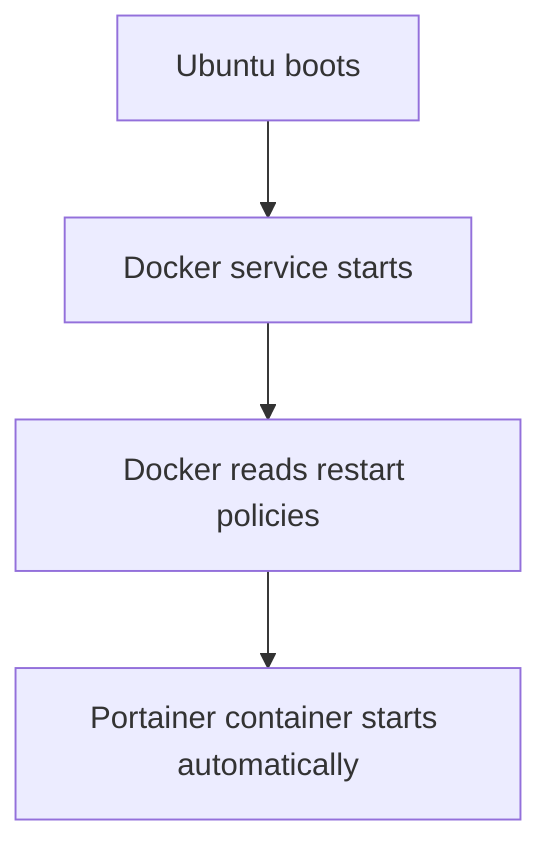
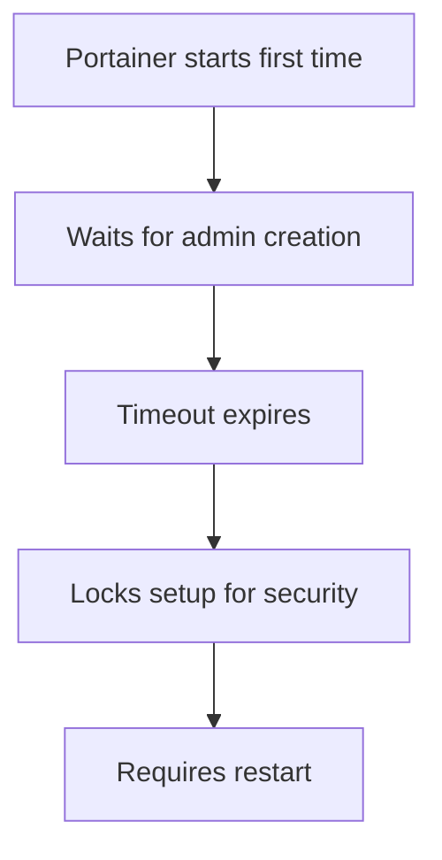
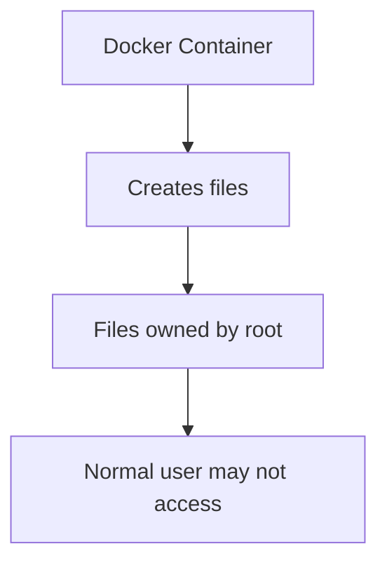
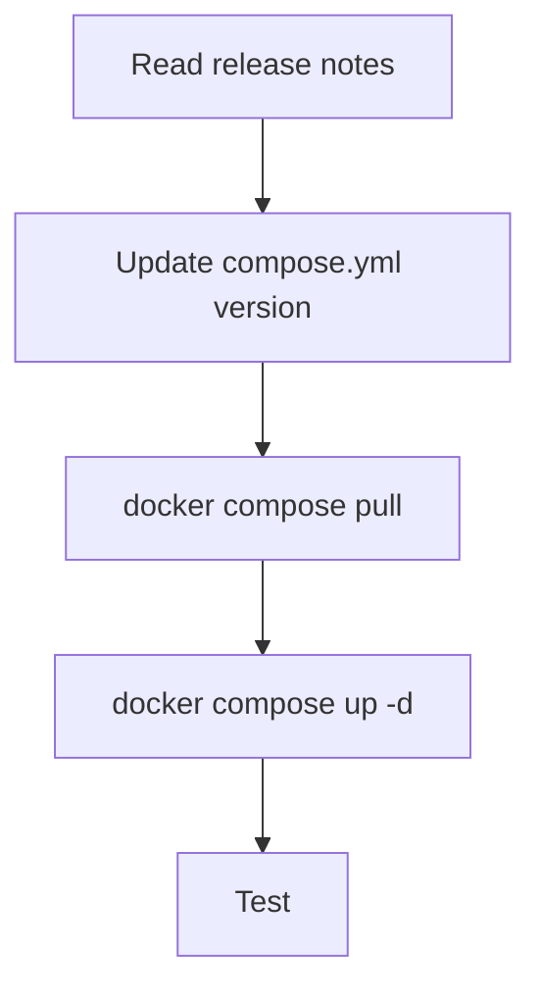
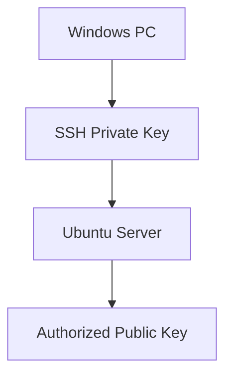
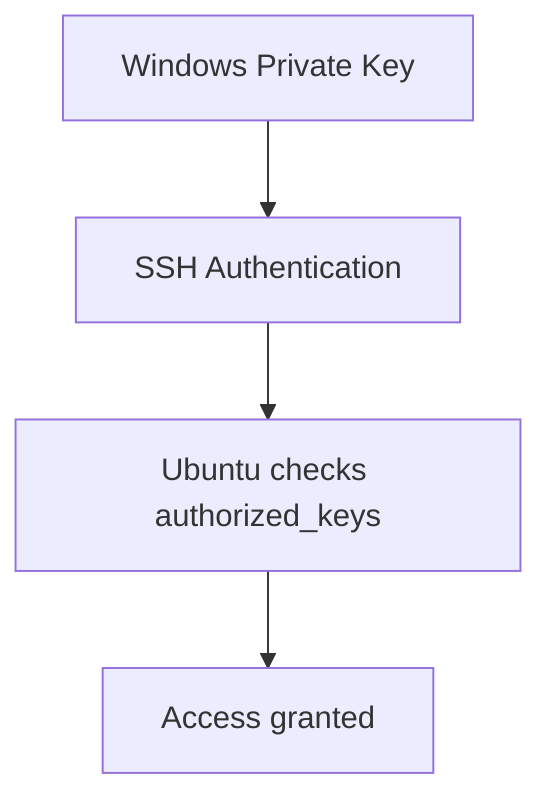
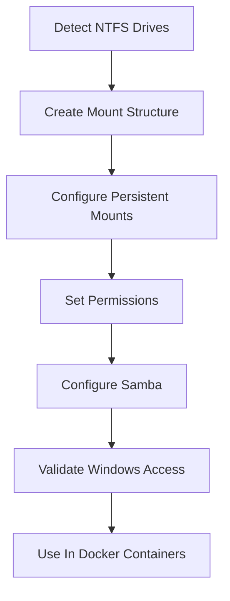
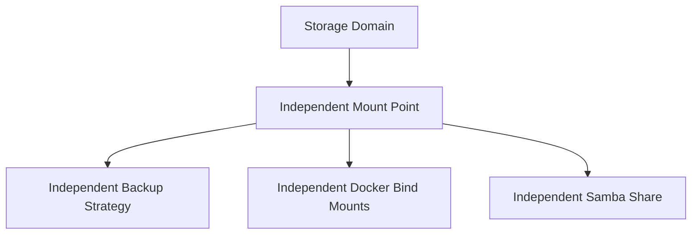
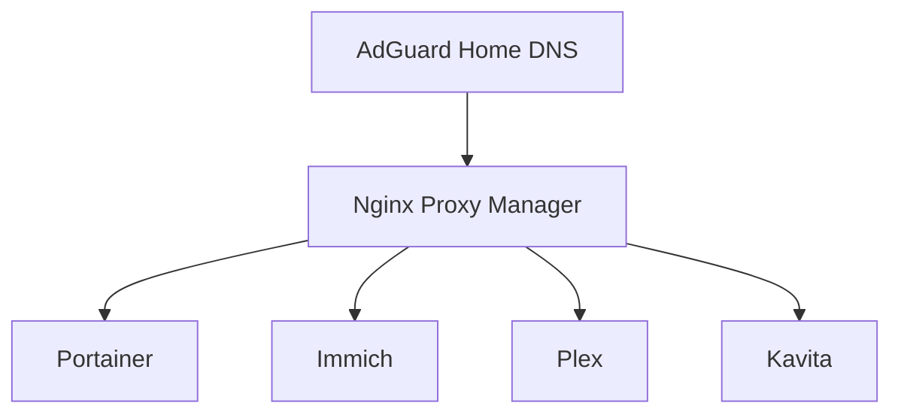

# Ubuntu Media Server Homelab Setup Guide

## Goal

Build a headless Ubuntu Server homelab/media server with:

- Docker
- Docker Compose
- SSH remote management
- Samba (Windows RW shares)
- Plex
- Immich
- Kavita
- Stash
- bitmagnet
- NTFS media disks
- SSD system drive
- Cockpit web UI
- Portainer
- Lazydocker

## Architecture

```text
NVMe SSD (ext4)
├── Ubuntu Server
├── Docker
├── Docker volumes
├── Databases
├── Plex metadata
└── Configs

NTFS HDDs
├── Movies
├── TV
├── Music
├── Books
├── Photos
└── Downloads
```

## Applications, Services, Media Persistence storage

| Purpose       | Storage Type   |
| ------------- | -------------- |
| App configs   | Docker volumes |
| Media library | Bind mounts    |
| Photos/videos | Bind mounts    |
| Databases     | Docker volumes |

## Storage Strategy

| Data Type   | Recommended              |
| ----------- | ------------------------ |
| App configs | `/srv/docker/appname`    |
| Media       | `/mnt/media`             |
| Downloads   | `/mnt/downloads`         |
| Databases   | `/srv/docker/appname/db` |
| Photos      | `/mnt/media/photos`      |


## Steps

### Prepare For Ubuntu Server Installation

#### 1. Prepare Bootable USB Flash Drive

- Download the latest [Ubuntu Server LTS](https://ubuntu.com/download/server?utm_source=chatgpt.com)
- USB Writing Tool (Windows) [Rufus](https://rufus.ie/?utm_source=chatgpt.com)

#### 2. Create Bootable USB

##### Recommended Settings

- Boot Selection: Ubuntu Server ISO
- Partition Scheme: GPT / if no UEFI support MBR
- File System: Leave default. (FAT32)
- Choose: ISO Mode (recommended)

| Setting          | Value          |
| ---------------- | -------------- |
| Ubuntu ISO       | 26.04 LTS      |
| Partition Scheme | GPT            |
| Target System    | UEFI           |
| File System      | FAT32          |
| Write Mode       | ISO Image Mode |


 


#### 3. BIOS Preparation

- Enable:
  - UEFI boot
  - AHCI mode for SATA
 
- Disable:
  - Fast Boot (optional)

#### 4. Install Ubuntu Server

- Tutorials, shell commands, Docker/YAML assume US layout

| Setting              | Value                      |
| -------------------- | -------------------------- |
| Layout               | English (US)               |
| Variant              | English (US)               |
| Installation         | Ubuntu Server (minimized)  |
| Proxy                | Blank                      |
| Use entire disk      | Selected                   |
| Mirror               | Default                    |
| LVM                  | Disable LVM                |
| Encryption (LUKS)    | Leave OFF                  |


##### Final Disk Layout

| Mount       | Type  | Size    |
| ----------- | ----- | ------- |
| `/`         | ext4  | ~1.8 TB |
| `/boot/efi` | FAT32 | 1 GB    |

##### Linux host

| Field       | Value                       |
| ----------- | --------------------------- |
| Your name   | `Piroman`                   |
| Server name | `piroman-server`            |
| Username    | `piroman`                   |

##### ENABLE OpenSSH server

That enables:

- Remote terminal access
- Windows SSH access
- Future Docker management
- Cockpit/Portainer workflow

##### Ubuntu PRO - Skip it

##### SSH Configuration

| Option                                 | Status |
| -------------------------------------- | ------ |
| Install OpenSSH server                 | ✅     |
| Allow password authentication over SSH | ✅     |
| Import SSH key                         |        |


### Connect through SSH to Ubuntu Server

```bash
ssh piroman@192.168.0.246
```


### Initial System Update

```bash
sudo apt update
sudo apt upgrade -y
```


### Remove no longer required packages

```bash
sudo apt autoremove -y
```


### Install Essential Packages

```bash
sudo apt install -y \
curl \
git \
htop \
btop \
tmux \
nano \
ncdu \
ufw \
smartmontools \
ca-certificates \
gnupg \
samba \
ntfs-3g \
cockpit
```

| Package           | Purpose                            | Why You Need It                                  |
| ----------------- | ---------------------------------- | ------------------------------------------------ |
| `curl`            | Command-line downloader/API client | Download scripts, test APIs, fetch files         |
| `git`             | Version control system             | Clone GitHub repos and manage configs            |
| `htop`            | Interactive process monitor        | View CPU/RAM/processes easily                    |
| `btop`            | Advanced terminal resource monitor | Beautiful real-time monitoring dashboard         |
| `tmux`            | Persistent terminal sessions       | Keep sessions running after SSH disconnects      |
| `nano`            | Terminal text editor               | Easy editing of config files                     |
| `ncdu`            | Disk usage analyzer                | Find large folders/files quickly                 |
| `ufw`             | Simple firewall manager            | Secure the server with manageable firewall rules |
| `smartmontools`   | Disk health monitoring             | Check SSD/HDD SMART health status                |
| `ca-certificates` | SSL certificate bundle             | Required for secure HTTPS connections            |
| `gnupg`           | GPG key management                 | Needed for trusted repositories like Docker      |
| `samba`           | Windows file sharing               | Share folders between Ubuntu and Windows         |
| `ntfs-3g`         | NTFS filesystem support            | Read/write Windows NTFS drives                   |
| `cockpit`         | Web management interface           | Manage server from browser                       |


### Configure Firewall

#### First check current firewall status:

```bash
sudo ufw status
```


#### Run the following commands to enable those services

```bash
sudo ufw allow OpenSSH
sudo ufw allow Samba
sudo ufw allow 9090/tcp
```

| Rule       | Purpose                     |
| ---------- | --------------------------- |
| `OpenSSH`  | Allows SSH remote access    |
| `Samba`    | Allows Windows file sharing |
| `9090/tcp` | Allows Cockpit web UI       |


#### Enable firewall

```bash
sudo ufw enable
```


#### Verify firewall status

```bash
sudo ufw status verbose
```


Current state:

| Service          | Status             |
| ---------------- | ------------------ |
| SSH              | Allowed            |
| Samba            | Allowed            |
| Cockpit (9090)   | Allowed            |
| Incoming traffic | Blocked by default |
| Outgoing traffic | Allowed            |


#### Cockpit web management

Open this in your Windows browser: https://192.168.0.246:9090


#### Turn on administrative access in Cockpit


#### Install Docker

```bash
# Install Docker Engine + Docker Compose
sudo apt install docker.io docker-compose-v2 -y

# Enable Docker at startup - Linux equivalent of Windows Services + Startup Type
sudo systemctl enable docker

# Start Docker now
sudo systemctl start docker

# Verify Docker works
sudo docker run hello-world

# Allow your user to run Docker without sudo
sudo usermod -aG docker piroman
```

| Package / Component          | Purpose                       | Why You Need It                                                          |
| ---------------------------- | ----------------------------- | ------------------------------------------------------------------------ |
| `docker.io`                  | Docker Engine                 | Runs containers (Plex, Immich, Kavita, Portainer, etc.)                  |
| `docker-compose-v2`          | Docker Compose plugin         | Lets you define and start multi-container apps using `compose.yml` files |
| `systemctl enable docker`    | Startup service configuration | Makes Docker automatically start after every reboot                      |
| `systemctl start docker`     | Starts Docker service now     | Immediately launches the Docker daemon without rebooting                 |
| `hello-world` container      | Docker test image             | Confirms Docker is installed and working correctly                       |
| `usermod -aG docker piroman` | Adds user to Docker group     | Allows `piroman` to use Docker without typing `sudo` every time          |


Log out of SSH and reconnect. After reconnecting, test:

```bash
docker ps
```
If no permission error appears, Docker is configured correctly.


### Important Concept

On Linux, almost everything important is a service. Examples: Docker, SSH, Samba, Cockpit, Plex, Databases. And all are managed similarly with:

```bash
systemctl
```


### Install Portainer

Portainer becomes your graphical Docker management UI. You’ll be able to:

- Start/Stop Containers
- View logs
- Manage stacks
- Update containers
- Inspect networks/volumes
- Deploy compose files visually

#### Create Docker-managed persistent storage volume for Portainer

A Docker-managed persistent storage volume is permanent storage that is separate from the container itself. It keeps application data safe even if containers are updated, recreated, restarted, or deleted, ensuring settings, databases, and configurations persist independently of the running container.

A Docker container is the running application instance itself — temporary and replaceable — while a Docker volume is persistent storage that holds the application’s important data, such as configurations, databases, and files. Containers can be recreated at any time, but volumes preserve the data independently, so nothing important is lost.

Docker stores volumes here by default: `/var/lib/docker/volumes/`, Portainer volume specifically: `/var/lib/docker/volumes/portainer_data/`.

1. Create Portainer Directory

```bash
sudo mkdir -p /srv/docker/portainer
```


2. Give Your User Ownership

```bash
sudo chown -R piroman:piroman /srv/docker
```


This allows Docker containers and your user to manage files cleanly.

3. Create Compose File

```bash
nano /srv/docker/portainer/compose.yml
```

```yaml
services:
  portainer:
    image: portainer/portainer-ce:lts
    container_name: portainer
    restart: unless-stopped

    ports:
      - "8000:8000"
      - "9443:9443"

    volumes:
      - /var/run/docker.sock:/var/run/docker.sock
      - /srv/docker/portainer/data:/data
```

What Happens After Reboot




4. Check and validate the YAML
   
```bash
cat /srv/docker/portainer/compose.yml
docker compose -f /srv/docker/portainer/compose.yml config
```


4. Run the Docker container

```bash
cd /srv/docker/portainer
docker compose up -d
```


5. Then, Verify Running

```bash
docker ps
```


Open the following URI: https://192.168.0.246:9443

If you see that your instance timed out, just restart the container.


Why This Happens. On first boot:



**Portainer waits for the initial admin setup for only a limited time.**

5a. Restart the container.

```bash
cd /srv/docker/portainer
docker compose restart
```


Then refresh: https://192.168.0.246:9443 and create an admin account


6. Connect Portainer to your local Docker environment

Clicking “Get Started” connects Portainer to your local Docker environment, allowing it to manage the Docker Engine running on the server. Once connected, Portainer provides a centralized web interface for viewing and managing containers, images, networks, volumes, and Compose stacks without using terminal commands for every operation.


### Current Infrastructure

| Component              | Status  |
| ---------------------- | ------  |
| Ubuntu Server          | ✅      |
| SSH                    | ✅      |
| UFW Firewall           | ✅      |
| Cockpit                | ✅      |
| Docker                 | ✅      |
| Docker Compose         | ✅      |
| Portainer              | ✅      |
| Infrastructure-as-Code | ✅      |


### Docker folder architecture

Before deploying containers, it is recommended to create a standardized Docker folder architecture. Organizing applications into dedicated directories provides predictable file paths, simplifies maintenance, and keeps infrastructure clean and scalable. 

This approach makes backups easier because each application’s configuration and persistent data are stored in known locations. It also simplifies migrations to another server, since entire application folders can be copied directly. In addition, structured directories lead to cleaner Docker Compose files and promote infrastructure consistency across all deployed services, which becomes increasingly important as the homelab grows.


#### Structure

```
/srv/docker
├── portainer
├── plex
├── immich
├── kavita
├── stash
├── adguard
└── nginx-proxy-manager
```

Each application should have its own isolated directory containing its Docker Compose file, configuration files, and persistent data. This structure keeps services separate, making management, troubleshooting, backups, and upgrades significantly easier. By following the principle of “one project = one directory,” every application becomes self-contained and portable, keeping the infrastructure organized, scalable, and easier to maintain over time.


##### Create Base Structure

```bash
mkdir -p /srv/docker/{plex,immich,kavita,adguard,nginx-proxy-manager}
```

##### Verify Structure

1. Install `tree` if missing:

```bash
sudo apt install tree -y
```


2. Execute `three` Command 

```bash
tree /srv/docker
```


##### Why This Happens

Portainer container writes some internal application data with elevated permissions for security and isolation. If You Want To Inspect Everything

```bash
sudo tree /srv/docker
```

This temporarily grants root privileges and allows viewing all directories.


### Important Concept - Linux file permissions and Docker

Linux file permissions are an important part of container isolation in Docker environments. Containers often create files and directories owned by the root user or by internal service accounts to protect application data and maintain security boundaries between services. As a result, normal users may not always have permission to access certain container-managed files directly, which is expected behavior and helps prevent accidental modification of critical application data.



### Important Concept - Why Floating Tags Can Be Risky

Using floating Docker image tags such as `latest`, `lts`, or `stable` can be risky because they do not point to a fixed application version. Over time, these tags may automatically reference newer releases containing configuration changes, database migrations, removed features, or breaking changes. As a result, running updates or redeploying containers can unexpectedly alter a working environment without any explicit version change in the Compose file. Pinning exact versions provides predictable, reproducible, and more stable infrastructure management.

#### Typical Upgrade Workflow



#### Pin the current LTS version

According to the screenshot, the current Portainer LTS line is: **2.39.2 LTS**


So instead of: `image: portainer/portainer-ce:lts` it should be pinned: `image: portainer/portainer-ce:2.39.2` or even `image: portainer/portainer-ce:2.39.2-alpine` if you intentionally want the Alpine variant.

1. Pin the correct version in the YAML file


2. Restart the container

```bash
cd /srv/docker/portainer
docker compose up -d
```


### SSH key authentication

Switching from password-based SSH authentication to SSH keys significantly improves security and convenience. SSH keys are resistant to brute-force attacks, cannot be guessed like passwords, and allow secure authentication without sending your password over the network. They are the standard authentication method used in professional Linux, cloud, and DevOps environments.

#### Goal




1. Step 1 — Generate SSH Key on Windows

```powershell
ssh-keygen -t ed25519 -C "piroman-windows"
```


`C:\Users\YOUR_USER\.ssh\`


2. Step 2 — Copy the public key

In Windows PowerShell, execute the following command and copy the full output 

```powershell
type $env:USERPROFILE\.ssh\ubuntu-server.pub
```

Then in Ubuntu 

```bash
# Create the .ssh directory if it does not already exist
mkdir -p ~/.ssh

# Set secure permissions so only the current user can access the directory
chmod 700 ~/.ssh

# Open the authorized_keys file to add allowed public SSH keys
nano ~/.ssh/authorized_keys
```

Then paste the output that was copied from Windows into the Ubuntu Server `~/.ssh/authorized_keys` file

3. Limit access to that file only for the current user. SSH requires strict permissions for security.

```bash
chmod 600 ~/.ssh/authorized_keys
```

4. Test SSH Keys

From Windows PowerShell, execute the following command. Now, you should connect without a Linux account password, possibly with an SSH key passphrase if you set one during key creation

```bash
ssh -i $env:USERPROFILE\.ssh\ubuntu-server piroman@192.168.0.246
```


#### What Happens During Login Now



#### Important Security Difference

| Old Method                       | New Method                       |
| -------------------------------- | -------------------------------- |
| Password sent for authentication | Cryptographic key authentication |
| Vulnerable to brute force        | Much more secure                 |
| Manual password typing           | Automatic authentication         |
| Common beginner setup            | Professional standard            |


### Implement Storage Architecture



#### Domain-oriented storage architecture

- Each physical drive has a defined responsibility
- Each mount point represents a storage domain
- Applications consume storage through stable paths




#### Goal

```
Physical Drive
    ↓
UUID
    ↓
Mount Point
    ↓
Persistent Mount
    ↓
Samba Share
    ↓
Docker Bind Mount
```

1. Step 1 — Connect Your External Drives

Shut down the server and connect the external drives.

```bash
sudo shutdown now
```

2. Step 2 — Detect Drives

```bash
lsblk -f
``` 


##### Current Drive Mapping

| Domain      | Device | Label  | Filesystem |
| ----------- | ------ | ------ | ---------- |
| `/mnt/iac`  | `sda2` | `IAC`  | NTFS       |
| `/mnt/lp`   | `sdb2` | `LP`   | NTFS       |
| `/mnt/data` | `sdc2` | `DATA` | NTFS       |
| `/mnt/ia`   | `sdd2` | `IA`   | NTFS       |
| `/mnt/comp` | `sdf2` | `COMP` | NTFS       |


3. Step 3 — Create Mount Points

```bash
# Create mount points for domain-oriented storage drives
sudo mkdir -p /mnt/iac
sudo mkdir -p /mnt/lp
sudo mkdir -p /mnt/data
sudo mkdir -p /mnt/ia
sudo mkdir -p /mnt/comp
```


4. Step 4 — Install NTFS Driver Support

```bash
sudo apt install ntfs-3g -y
```


5. Step 5 — Configure Persistent Mounts

Persistent mounts allow Linux to automatically mount storage drives during every system boot without requiring manual intervention. This is configured through the `/etc/fstab` file, where each drive is identified by its UUID — a stable, unique identifier that does not change between reboots. Using persistent mounts ensures that all storage domains are immediately available to Docker containers, Samba shares, media servers, and other services after the server starts.

```bash
sudo nano /etc/fstab
```

Current fstab

The current `/etc/fstab` file contains the default filesystem configuration created during Ubuntu installation. It defines the main Linux system partition (/), the EFI boot partition (/boot/efi), and the swap file used for virtual memory. These entries ensure the operating system and boot components are automatically mounted and available during every system startup.

The /etc/fstab file defines which storage devices Linux should automatically mount during boot. By adding our NTFS drives to fstab, we created persistent mounts that survive reboots and always appear in the same locations, such as /mnt/iac, /mnt/lp, /mnt/data, /mnt/ia, and /mnt/comp. Each entry uses the drive UUID instead of device names like /dev/sda2, making the configuration more reliable even if drive ordering changes.


Extended fstab

The extended `/etc/fstab` configuration now includes persistent NTFS domain drive mounts, allowing all storage drives to be automatically mounted and consistently available after every system reboot.


| Mount Point | UUID in `lsblk -f` | UUID in `fstab`    | Status |
| ----------- | ------------------ | ------------------ | ------ |
| `/mnt/iac`  | `6A3AD04D3AD017C1` | `6A3AD04D3AD017C1` | ✅      |
| `/mnt/lp`   | `8CEEDEBAEEDE9BB0` | `8CEEDEBAEEDE9BB0` | ✅      |
| `/mnt/data` | `A4D09E95D09E6D74` | `A4D09E95D09E6D74` | ✅      |
| `/mnt/ia`   | `7698C86698C82689` | `7698C86698C82689` | ✅      |
| `/mnt/comp` | `D6E66FCAE66FA987` | `D6E66FCAE66FA987` | ✅      |

Initially, the NTFS drives were mounted with `umask=0022`, which made Samba shares appear read-only to Windows. This was solved by changing the mount option to `umask=0000`, which allows full read/write access through Samba while still mapping ownership to the piroman Linux user (`uid=1000`, `gid=1000`). After reloading the mounts and restarting Samba, the shares became fully writable from Windows.

| Property   | Example Value | Purpose                                                                                        |
| ---------- | ------------- | ---------------------------------------------------------------------------------------------- |
| `uid`      | `1000`        | Sets the Linux owner user ID for all files on the NTFS drive                                   |
| `gid`      | `1000`        | Sets the Linux group ID for all files on the NTFS drive                                        |
| `umask`    | `0022`        | Removes write permissions for group/others, resulting in mostly read-only access through Samba |
| `umask`    | `0000`        | Allows full read/write permissions for all users accessing the mounted NTFS drive              |
| `nofail`   | `nofail`      | Prevents boot failure if the drive is disconnected or unavailable                              |
| `defaults` | `defaults`    | Applies standard Linux mount behavior                                                          |
| `ntfs-3g`  | `ntfs-3g`     | Linux NTFS driver providing NTFS read/write support                                            |

Example final mount configuration:

`UUID=A4D09E95D09E6D74 /mnt/data ntfs-3g defaults,uid=1000,gid=1000,umask=0000,nofail 0 0`

This configuration gives Linux and Samba stable ownership, persistent mounting, and full Windows read/write compatibility for the shared NTFS drives.


6. Step 6 - Test the mount configuration safely before rebooting.

The `sudo mount -a` command instructs Linux to immediately mount all filesystems defined in `/etc/fstab`, allowing the configuration to be tested without rebooting the server.

```bash
# “Attempt to mount everything defined inside /etc/fstab right now.”
sudo mount -a
```


7. Step 7 - Clean NTFS dirty flags

The `ntfsfix` utility is used to safely clear NTFS dirty or hibernation flags left by Windows, allowing the drives to be mounted normally in Linux with full read-write access.

```bash
sudo ntfsfix /dev/sda2
sudo ntfsfix /dev/sdb2
sudo ntfsfix /dev/sdc2
sudo ntfsfix /dev/sdd2
sudo ntfsfix /dev/sdf2
```


8. Step 8 - Test the mount configuration **again** before rebooting.

```bash
sudo mount -a
```


9. Step 9 - Verify that drives are mounted correctly.

The df -h command displays all currently mounted filesystems, their storage usage, available free space, and mount locations in a human-readable format, such as GB and TB.

```bash
df -h
```


Mount points confirmation

| Mount Point | Size | Usage | Status |
| ----------- | ---- | ----- | ------ |
| `/mnt/iac`  | 3.7T | 49%   | ✅      |
| `/mnt/lp`   | 7.3T | 50%   | ✅      |
| `/mnt/data` | 7.3T | 39%   | ✅      |
| `/mnt/ia`   | 3.7T | 85%   | ✅      |
| `/mnt/comp` | 3.7T | 28%   | ✅      |


### Samba network shares

Samba network shares allow Linux directories to be shared over the network using the SMB protocol, making them accessible from Windows systems through File Explorer, like standard network drives. This enables the Ubuntu server to function similarly to a NAS by providing centralized storage access for media, backups, and shared files across the local network.


Step 1 — Install Samba

Samba enables Linux systems to share files and folders over the network using the SMB protocol, allowing Windows devices to access them like standard network drives.

```bash
sudo apt install samba -y
```


Step 2 — Backup Existing Samba Config

```bash
sudo cp /etc/samba/smb.conf /etc/samba/smb.conf.backup
```


Step 3 — Open Samba Configuration

```bash
sudo nano /etc/samba/smb.conf
```


Step 4 — Add Your Domain Shares

Append this at the bottom:

```ini

[iac]
   path = /mnt/iac
   browseable = yes
   writable = yes
   guest ok = no
   valid users = piroman

[lp]
   path = /mnt/lp
   browseable = yes
   writable = yes
   guest ok = no
   valid users = piroman

[data]
   path = /mnt/data
   browseable = yes
   writable = yes
   guest ok = no
   valid users = piroman

[ia]
   path = /mnt/ia
   browseable = yes
   writable = yes
   guest ok = no
   valid users = piroman

[comp]
   path = /mnt/comp
   browseable = yes
   writable = yes
   guest ok = no
   valid users = piroman
```


| Option          | Purpose                      |
| --------------- | ---------------------------- |
| `path`          | Linux directory being shared |
| `browseable`    | visible on network           |
| `writable`      | allows write access          |
| `guest ok = no` | requires authentication      |
| `valid users`   | allowed Samba users          |


```bash
# Validate the configuration safely
testparm
```


5. Step 5 - Create Samba User Password

```bash
# This creates the Samba authentication account for: piroman
sudo smbpasswd -a piroman
```


6. Step 6 — Restart Samba

```bash
sudo systemctl restart smbd
```

7. Step 7 — Verify Samba Running

```bash
sudo systemctl status smbd
```


8. Step 8 — Open Samba In Firewall

You already did this earlier with:

```bash
sudo ufw allow Samba
```


9. Step 9 — Access From Windows


In Windows Explorer:

```
\\192.168.0.246
```

or 

```
\\piroman-server
```

With IP works, with name not (for now).


Drives that were successfully mapped in Windows


### DNS and Reverse Proxy

Nginx Proxy Manager becomes the centralized ingress layer for all services.



| Component     | Solves                                       |
| ------------- | -------------------------------------------- |
| DNS           | “Where is this service?”                     |
| Reverse Proxy | “Which backend should receive this request?” |


#### DNS Foundation (AdGuard Home)

1. Create AdGuard Home Directory Structure

Create isolated application directories following the established Docker architecture principle:

```bash
mkdir -p /srv/docker/adguard-home/{work,conf}
```

This creates:
  - work/ → runtime/work data
  - conf/ → persistent configuration

2. Create AdGuard Home Compose File

Navigate to the application directory:

```bash
cd /srv/docker/adguard-home
```

Create the compose file:

```bash
nano compose.yml
```


3. Add AdGuard Home Docker Compose Configuration

```yaml
services:
  adguard-home:
    image: adguard/adguardhome:latest
    container_name: adguard-home
    restart: unless-stopped

    ports:
      - "53:53/tcp"
      - "53:53/udp"
      - "67:67/udp"
      - "68:68/udp"
      - "3000:3000/tcp"
      - "80:80/tcp"

    volumes:
      - ./work:/opt/adguardhome/work
      - ./conf:/opt/adguardhome/conf
```


| Port Mapping    | Protocol | Purpose                                                                                          |
| --------------- | -------- | ------------------------------------------------------------------------------------------------ |
| `53:53/tcp`     | TCP      | Standard DNS queries over TCP. Used for larger DNS responses and some advanced DNS operations.   |
| `53:53/udp`     | UDP      | Main DNS traffic port. Most DNS queries from client devices use UDP.                             |
| `67:67/udp`     | UDP      | DHCP server port used when AdGuard Home provides automatic IP address assignment on the network. |
| `68:68/udp`     | UDP      | DHCP client communication port paired with DHCP server operations.                               |
| `3000:3000/tcp` | TCP      | Initial AdGuard Home setup web interface. Used only during first-time configuration.             |
| `80:80/tcp`     | TCP      | Main AdGuard Home web management interface after setup completion.                               |


###### DNS Ports (53)

Ports `53/tcp` and `53/udp` are the core DNS communication ports used by `AdGuard Home` to process DNS requests from client devices. Most standard DNS queries use UDP, while TCP is used for larger responses and specific DNS operations. Without these ports exposed, `AdGuard Home` cannot function as a network DNS server.


###### DHCP Ports (67, 68)

Ports `67/udp` and `68/udp` are used for DHCP communication when `AdGuard Home` acts as a DHCP server, assigning IP addresses to devices on the network. In the current setup, the ISP router still manages DHCP. Hence, these ports are not immediately required but are kept available for possible future migration of DHCP functionality to `AdGuard Home`.

###### Web Interface Ports (3000, 80)

Ports `3000/tcp` and `80/tcp` provide access to the `AdGuard Home` web management interface. Port `3000` is primarily used during the initial setup wizard, while port 80 serves as the main web administration interface after setup completion. These ports allow browser-based configuration and management of DNS settings, filters, and local domain rewrites.


4. Validate Compose File

```bash
docker compose config
```

This validates:

  - YAML syntax
  - Docker Compose structure
  - Configuration correctness


5. Deploy AdGuard Home

```bash
docker compose up -d
```
This command does the following tasks:

  - Downloads the image
  - Creates the container
  - Attaches persistent storage
  - Starts AdGuard Home

##### Get an error that port 53 is already in use


###### Verify What Uses Port 53

```bash
# Show which process/service is currently using DNS port 53
sudo lsof -i :53
```

Command Not Found 


or 

``` bash
# Display active network listeners and filter for services using port 53
sudo ss -tulpn | grep :53
```


The `systemd-resolved` process is currently binding port `53`, preventing `AdGuard Home` from starting its DNS server.

`systemd-resolved` is Ubuntu’s built-in local DNS resolver service responsible for handling DNS queries, caching DNS responses, and forwarding DNS requests to external DNS servers configured on the system. By default, it listens on the local DNS port 53, allowing Ubuntu itself to perform domain name resolution (for example, resolving google.com to an IP address).

###### So if Ubuntu already has a DNS resolver, why do I need AdGuard Home?

`systemd-resolved` and `AdGuard Home` serve very different purposes, even though both are related to DNS.

`systemd-resolved` is a lightweight local DNS resolver designed primarily for Ubuntu. Its job is to help the operating system resolve Internet domain names, cache DNS requests, and forward queries to external DNS servers. It is intended for local system functionality, not for managing an entire network.

`AdGuard Home`, on the other hand, is a full-featured network DNS platform designed to serve all devices in the homelab. It provides centralized DNS management, ad blocking, tracking protection, local domain rewrites, DNS filtering, statistics, custom records, parental controls, and future integration with reverse proxies and internal infrastructure services.

| Component          | Purpose                                                     |
| ------------------ | ----------------------------------------------------------- |
| `systemd-resolved` | Basic Ubuntu local DNS resolver                             |
| AdGuard Home       | Centralized network-wide DNS server and management platform |


After migration:

- Ubuntu itself will still use DNS normally
- But AdGuard Home becomes the primary DNS authority for:
  - Windows devices
  - Phones
  - Docker services
  - Local homelab domains
  - Ad blocking
  - Internal infrastructure routing

This is why AdGuard Home is a foundational infrastructure component, while systemd-resolved is only an operating system utility.


6. Disable Ubuntu DNS Stub Listener

Edit resolved configuration in `/etc/systemd/resolved.conf` find this line `#DNSStubListener=yes` and change it to `DNSStubListener=no`. If the line does not exist, add it manually anywhere under [Resolve].


7. Restart systemd-resolved

```bash
sudo systemctl restart systemd-resolved
```


8. Recreate resolv.conf Symlink

```bash
# This ensures Ubuntu continues to resolve DNS properly after disabling the stub listener.
sudo ln -sf /run/systemd/resolve/resolv.conf /etc/resolv.conf
```


9. Check that Ubuntu itself can still resolve internet domain names correctly through DNS

```bash
ping google.com
```

or 

```bash
resolvectl query google.com
```


This confirms everything is working correctly. Ubuntu successfully:

- resolved `google.com`
- returned both IPv4 and IPv6 addresses
- used DNS normally after disabling the stub listener

Most importantly:

- `systemd-resolved` still functions as Ubuntu’s DNS resolver

10. Verify Port 53 Is Free

```bash
sudo ss -tulpn | grep :53
```


11. Then Start AdGuard Home Again

At that point, `AdGuard Home` should successfully claim port `53` and start normally.

```bash
cd /srv/docker/adguard-home
docker compose up -d
```


