# ShadowBroker Complete Deployment Documentation & Operations Runbook

## 1. Purpose

This document describes the ShadowBroker server deployment:

- what was built
- why each design decision was made
- how it was implemented
- how to operate, update, troubleshoot, back up, and recover the system

ShadowBroker runs as a self-hosted Docker Compose application providing:

- Frontend web interface
- Backend API services
- Scheduler and ingestion services
- AI agent integration
- InfOnet trust functionality
- Wormhole identity functionality
- I2P private transport support

---

## 2. Deployment Architecture

### Server

Host:

- `pirman-server`
- LAN IP: `192.168.0.10`

Installation directory:

```text
/srv/docker/shadowbroker
```

Directory structure:

```text
/srv/docker/shadowbroker/
├── compose.yml
├── .env
├── data/
│   └── backend/
└── i2pd/
```

Reason:

Application configuration, persistent state, and container definitions are kept together so the entire stack is easy to back up, restore, inspect, and operate.

### Architecture Diagram

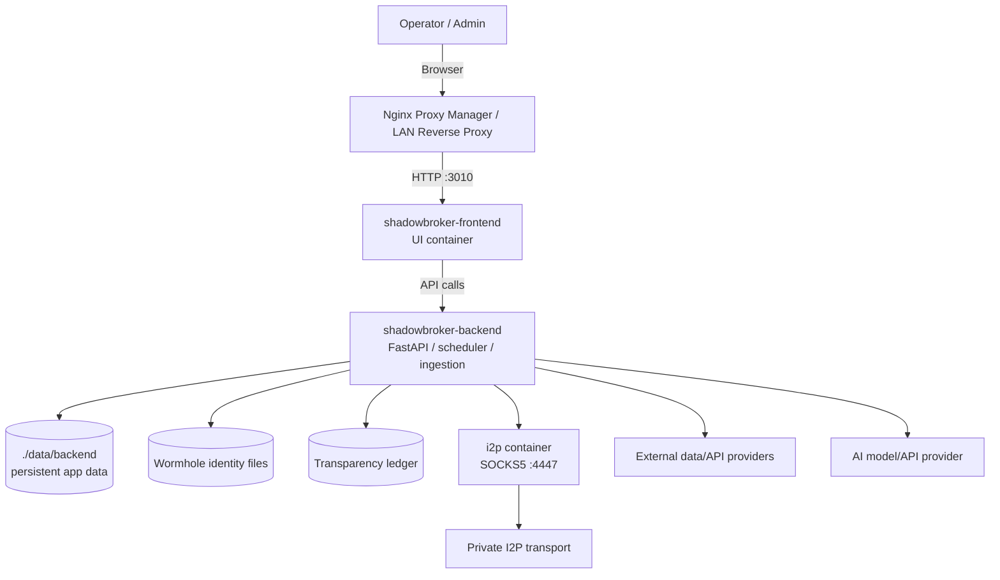

---

## 3. Container Stack

### Frontend

Container:

```text
shadowbroker-frontend
```

Purpose:

- Provides the ShadowBroker web interface
- Talks to the backend APIs

Ports:

```text
External: 3010
Internal: 3000
```

Configured through:

```env
FRONTEND_PORT=3010
```

### Backend

Container:

```text
shadowbroker-backend
```

Purpose:

- REST API
- Data processing
- Scheduler
- Feed ingestion
- AI agent services
- InfOnet verification
- Wormhole identity management

Ports:

```text
External: 8010
Internal: 8000
```

Configured through:

```env
BACKEND_PORT=8010
```

### I2P

Purpose:

Provides private network transport.

Ports:

```text
7070
4447
```

Internal Docker communication:

```text
i2p:4447
```

LAN access:

```text
192.168.0.10:4447
```

### Container Relationship Diagram

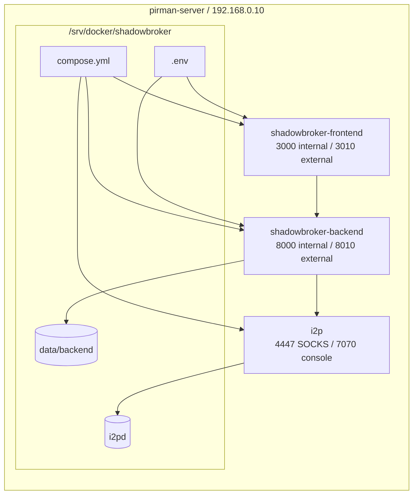

---

## 4. Configuration Strategy

### Why `.env` Exists

The deployment separates static infrastructure from deployment-specific values.

Static infrastructure:

```text
compose.yml
```

Environment-specific settings:

```text
.env
```

This allows updates without rewriting Docker configuration.

Important values:

```env
SHADOWBROKER_VERSION=x.x.x
FRONTEND_PORT=3010
BACKEND_PORT=8010
ADMIN_KEY=<secret>
```

### Configuration Flow

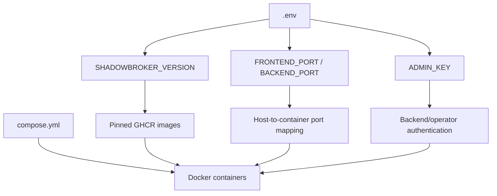

---

## 5. Version Management

Images are pinned.

Reason:

Pinned versions avoid accidental upgrades and reduce the risk of unexpected breaking changes.

Current version is controlled with:

```env
SHADOWBROKER_VERSION=
```

Upgrade example:

```diff
-SHADOWBROKER_VERSION=0.9.83
+SHADOWBROKER_VERSION=0.9.84
```

---

## 6. Daily Operations Runbook

### Enter Application Directory

```bash
cd /srv/docker/shadowbroker
```

### Start ShadowBroker

```bash
docker compose up -d
```

### Stop ShadowBroker

```bash
docker compose down
```

### Restart Everything

```bash
docker compose restart
```

### Restart Backend Only

```bash
docker compose restart backend
```

### Force Recreate Backend

```bash
docker compose up -d --force-recreate backend
```

### Basic Operations Flow

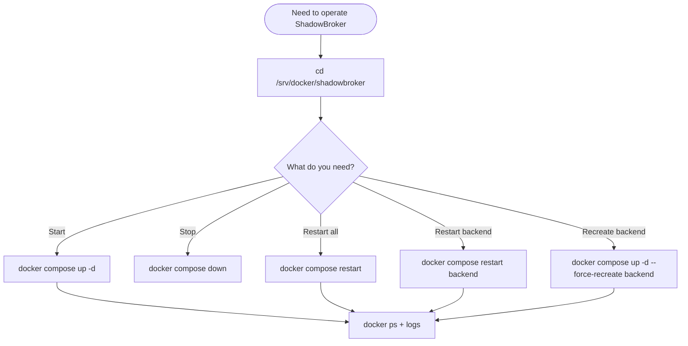

---

## 7. Health Checks

### Check Containers

```bash
docker ps | grep -E "shadowbroker|i2p"
```

Expected:

```text
shadowbroker-backend    Up
shadowbroker-frontend   Up
i2p                     Up
```

### Backend API Test

```bash
curl http://127.0.0.1:8000
```

### Health Check Decision Tree

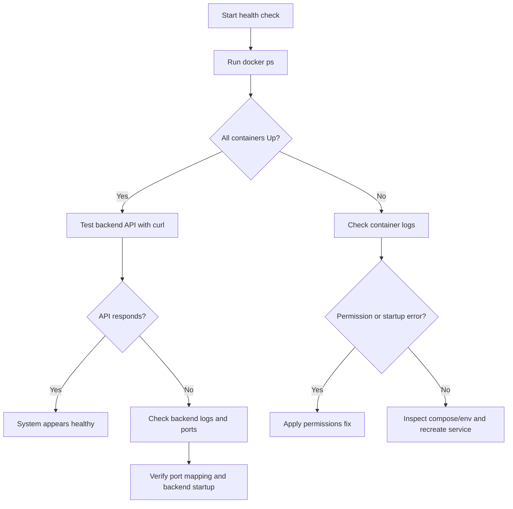

---

## 8. Logs

Everything:

```bash
docker compose logs -f
```

Backend:

```bash
docker logs -f shadowbroker-backend
```

Frontend:

```bash
docker logs -f shadowbroker-frontend
```

I2P:

```bash
docker logs -f i2p
```

Search errors:

```bash
docker logs shadowbroker-backend 2>&1 | grep ERROR
```

Healthy backend example:

```text
Application startup complete
Uvicorn running on http://0.0.0.0:8000
```

---

## 9. Updating ShadowBroker

### Step 1 - Backup

```bash
cd /srv/docker
tar czvf shadowbroker-backup.tar.gz shadowbroker/
```

### Step 2 - Edit Version

```bash
cd /srv/docker/shadowbroker
nano .env
```

Change:

```env
SHADOWBROKER_VERSION=new_version
```

### Step 3 - Pull Images

```bash
docker compose pull
```

### Step 4 - Deploy

```bash
docker compose up -d
```

### Step 5 - Verify

```bash
docker ps
docker logs shadowbroker-backend -f
```

### Update Workflow

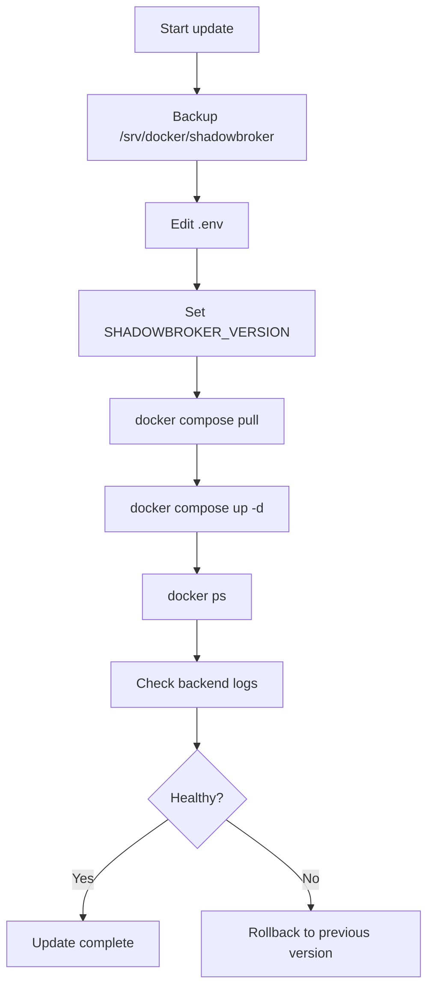

---

## 10. Rollback Procedure

Edit:

```text
.env
```

Restore previous version:

```env
SHADOWBROKER_VERSION=old_version
```

Run:

```bash
docker compose pull
docker compose up -d
```

### Rollback Workflow

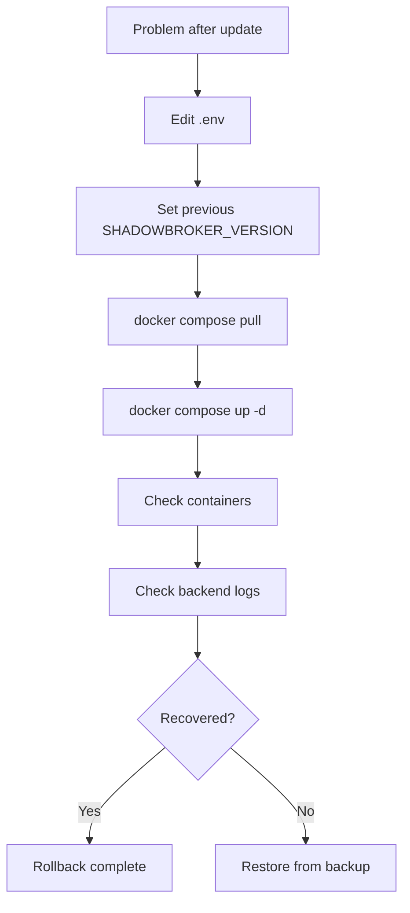

---

## 11. Backup & Restore

### Backup

```bash
cd /srv/docker
tar czvf shadowbroker-backup.tar.gz shadowbroker/
```

Protect this backup because it contains:

- configuration
- `ADMIN_KEY`
- persistent identity files
- application state

### Restore

```bash
tar xzvf shadowbroker-backup.tar.gz -C /srv/docker/
cd /srv/docker/shadowbroker
docker compose up -d
```

### Backup and Restore Diagram

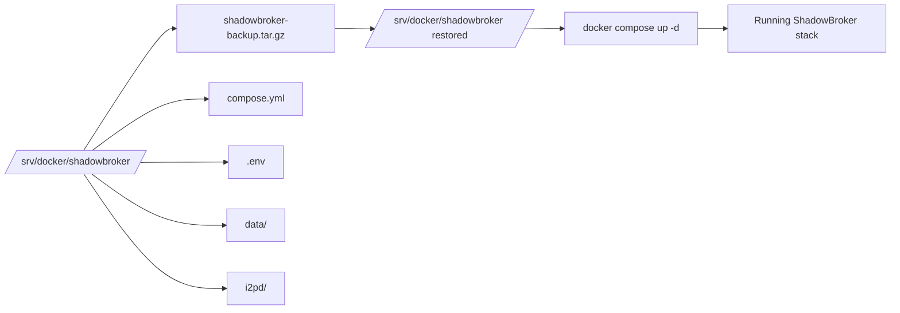

---

## 12. Wormhole Operations

Stored under:

```text
/app/data/
```

Important files:

```text
wormhole.json
wormhole_status.json
operator_api_keys.env
```

Check:

```bash
docker exec shadowbroker-backend ls /app/data
```

### Wormhole Data Flow

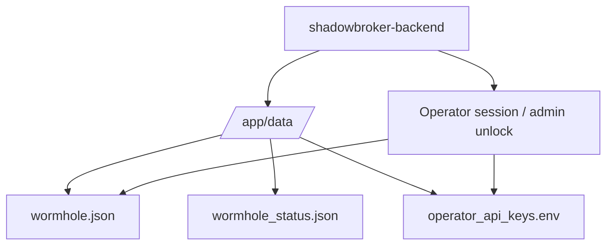

---

## 13. InfOnet Trust

Transparency ledger:

```text
/app/data/transparency/
```

Expected state:

```text
TRANSPARENCY CURRENT
```

External witness:

- Optional for LAN deployments
- Required only for stronger independent trust verification

### InfOnet Trust Model

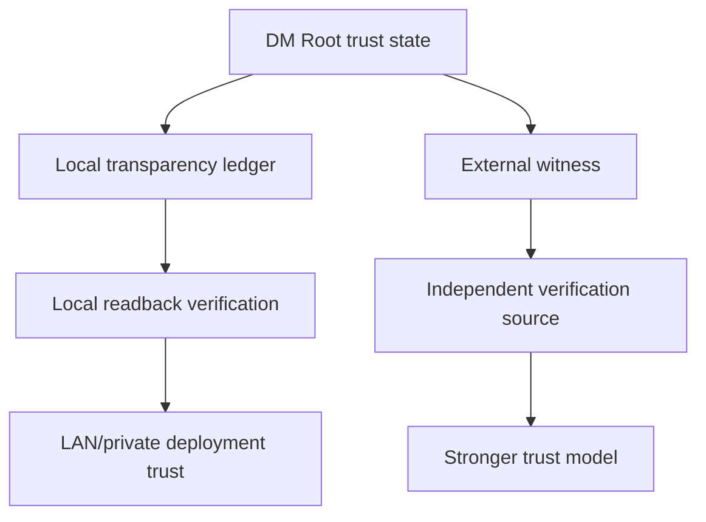

---

## 14. Permissions Troubleshooting

### Backend Database Error

Example:

```text
sqlite3.OperationalError
unable to open database file
```

Fix:

```bash
cd /srv/docker/shadowbroker

sudo mkdir -p data/backend
sudo chown -R 1000:1000 data/backend
sudo chmod -R 775 data/backend

docker compose restart backend
```

### I2P Permissions

```bash
sudo chown -R 100:65534 i2pd
docker compose restart i2p
```

### Permissions Troubleshooting Flow

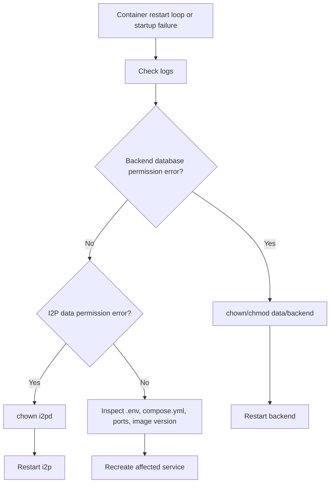

---

## 15. Network Troubleshooting

Windows tests:

```powershell
Test-NetConnection 192.168.0.10 -Port 3010
Test-NetConnection 192.168.0.10 -Port 8010
Test-NetConnection 192.168.0.10 -Port 4447
```

### Network Path

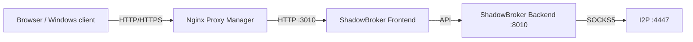

---

## 16. Reverse Proxy

Recommended:

Scheme:

```text
http
```

Forward host/IP:

```text
192.168.0.10
```

Forward port:

```text
3010
```

Enable:

- SSL
- HTTP/2
- WebSocket support
- Block common exploits

### Reverse Proxy Flow

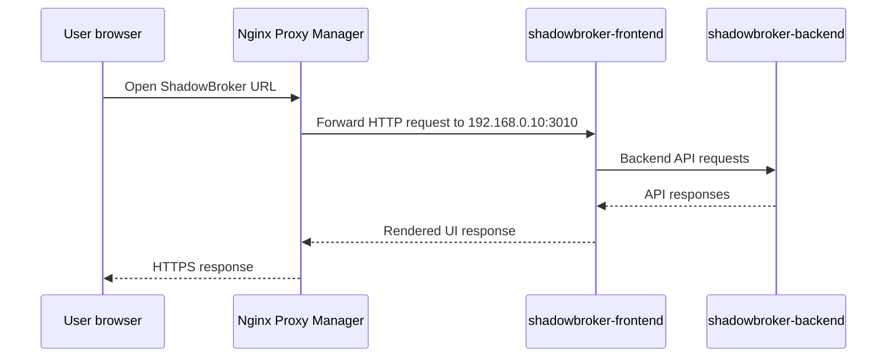

---

## 17. Maintenance Checklist

### Daily

- Verify containers are running
- Check backend logs
- Confirm feeds operate
- Review InfOnet status

### Weekly

- Backup `/srv/docker/shadowbroker`
- Review available updates
- Verify API keys
- Check Docker storage

### Monthly

- Test restore process
- Review exposed ports
- Rotate secrets if required

### Maintenance Cycle

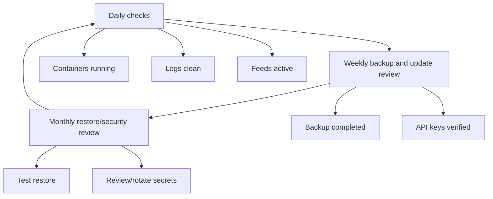

---

## 18. Clean Rebuild Procedure

Warning:

This removes ShadowBroker state.

```bash
cd /srv/docker/shadowbroker

docker compose down

sudo rm -rf data
sudo rm -rf i2pd

mkdir -p data/backend
mkdir -p i2pd

sudo chown -R 1000:1000 data
sudo chown -R 100:65534 i2pd

docker compose pull
docker compose up -d
```

### Clean Rebuild Flow

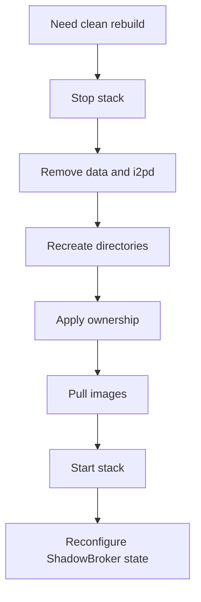

---

## 19. Recovery Principle

The important assets are:

1. `compose.yml`
2. `.env`
3. `data/`
4. `i2pd/`

With those restored, the complete ShadowBroker environment can be rebuilt.

### Recovery Dependency Diagram

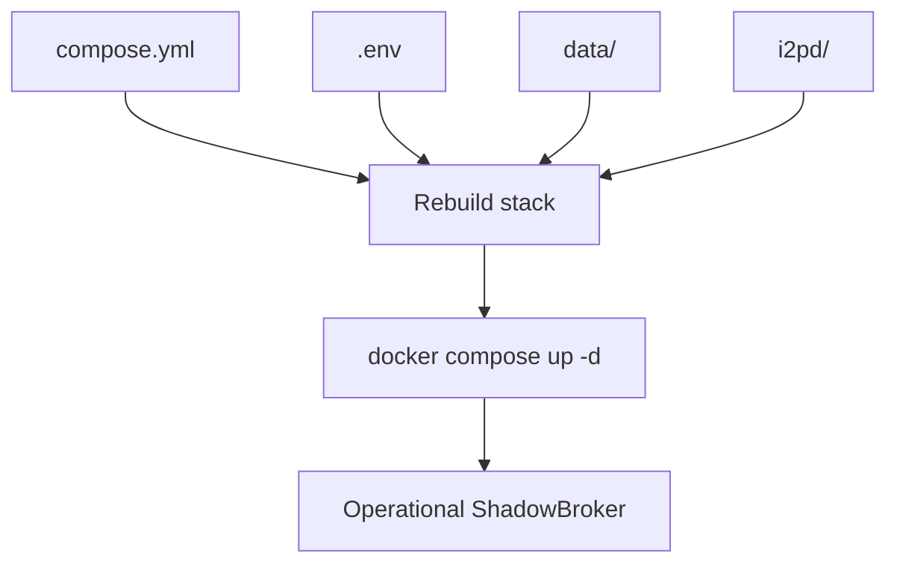

---

## 20. Useful Commands Reference

Enter backend:

```bash
docker exec -it shadowbroker-backend sh
```

Inspect ports:

```bash
docker port shadowbroker-backend
docker port i2p
```

Recreate one service:

```bash
docker compose up -d --force-recreate SERVICE
```

Example:

```bash
docker compose up -d --force-recreate i2p
```

View resource usage:

```bash
docker stats
```

Clean unused Docker resources:

```bash
docker system prune
```

---

## 21. Final Notes

For private LAN operation, required items are:

- Backend running
- Feeds active
- Transparency current

Optional items are:

- External witness
- Strong Trust

Strong Trust requires another trusted witness source.
