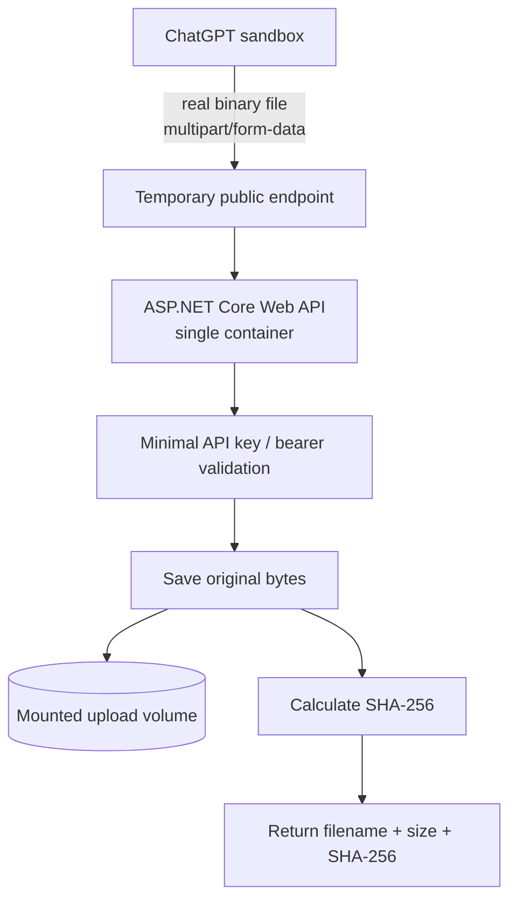

# Binary Artifact Upload PoC

Status: Planned
Purpose: Prove whether ChatGPT can transfer a real binary file from its sandbox to a self-hosted endpoint without Base64/JSON transport.
Related docs: [Roadmaps index](./README.md)

## Objective

Build the smallest possible self-hosted proof of concept that answers one question:

> Can ChatGPT upload a real binary file from its sandbox to a public self-hosted endpoint and preserve the file byte-for-byte?

This PoC intentionally stops at transport validation. It is not the full Artifact Bridge architecture.

---

## Scope

The PoC consists of exactly one application container.

Technology baseline:

- C# / .NET
- ASP.NET Core Web API
- Controller-based API
- Standard `multipart/form-data` file upload
- Mounted persistent volume for received files
- Minimal bearer/API-key authentication
- SHA-256 verification

Implementation details such as class layout, middleware choices, logging framework, validation library, folder naming, and exact configuration structure are deliberately left for implementation time.

---

## Architecture



For the PoC, the public endpoint may be exposed through a temporary high-numbered forwarded port. Production connectivity is explicitly out of scope.

---

## API Contract

The service exposes one upload operation conceptually equivalent to submitting a standard HTML file form:

```text
POST /upload
Content-Type: multipart/form-data
Authorization: Bearer <secret>
```

The request contains one binary file part.

The response must include at least:

```json
{
  "fileName": "test.jpg",
  "size": 278421,
  "sha256": "<hex-sha256>",
  "stored": true
}
```

The exact controller route and DTO names are implementation details.

---

## Storage Behaviour

The uploaded file is written unchanged to a mounted container volume.

The PoC performs no image processing, conversion, optimization, archive handling, Git operations, or downstream workflow execution.

The stored file exists only so its bytes, size, and SHA-256 can be compared with the source file from the ChatGPT sandbox.

---

## Authentication

The PoC requires only minimal protection sufficient for a temporary internet-facing test endpoint:

- static API key or bearer secret;
- no OAuth;
- no GitHub authentication;
- no user-management subsystem.

The production security model is not part of this PoC.

---

## Success Criteria

The PoC succeeds only when all of the following are demonstrated with a real binary file originating in the ChatGPT sandbox:

1. ChatGPT can invoke the upload integration with the sandbox file as an actual file input.
2. The ASP.NET Core endpoint receives it as binary `multipart/form-data`, not as Base64 embedded in JSON.
3. The service stores the complete file in the mounted volume.
4. Received file size equals source file size.
5. Received SHA-256 equals source SHA-256.

The decisive condition is:

```text
source SHA-256 == received SHA-256
```

If the integration layer cannot provide the sandbox file as a real binary upload, the PoC is considered failed and no broader architecture should be built around that transport assumption.

---

## Explicit Non-Goals

This PoC does **not** include:

- Artifact Bridge coordinator;
- SQLite state store;
- GitHub App;
- GitHub Actions self-hosted runner;
- processor service;
- `job.json` workflow;
- email/IMAP ingest;
- multi-container orchestration;
- binary processing;
- automatic PR creation or repository write-back;
- production-grade public exposure.

These belong to a later design phase only if direct binary transport is proven viable.

---

## Future Direction

If the PoC succeeds, the result can become the binary-ingress foundation for a future generic Artifact Bridge project.

A likely production connectivity option is an outbound tunnel such as Cloudflare Tunnel so the final service can be exposed through HTTPS without requiring inbound ports 80/443 on the home router. This is only a future direction and is not part of the PoC implementation.

---

## Implementation Gate

Do not expand this roadmap into the full Artifact Bridge until the binary transfer test has passed.

The next implementation session should build only the single ASP.NET Core container described above, expose it temporarily, and perform the end-to-end SHA-256 test.