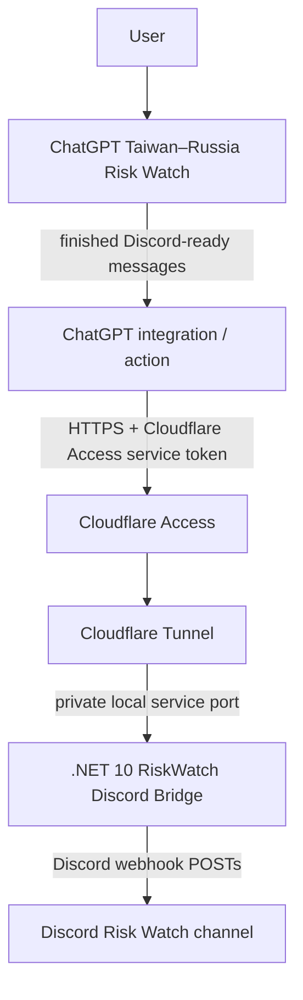

# Taiwan–Russia Risk Watch Discord Bridge

Status: Planned
Purpose: Publish completed ChatGPT-generated Taiwan–Russia 2027–2030 Risk Watch updates directly into Discord through a small self-hosted C# bridge.
Depends on: Ubuntu Docker host, Cloudflare account/domain, Discord channel webhook, ChatGPT integration/action capable of authenticated HTTPS calls
Related docs: [Roadmaps index](./README.md), [Docker and Portainer](../platform/docker-and-portainer.md), [Networking and reverse proxy](../platform/networking-and-reverse-proxy.md)

## Objective

Remove the manual copy/paste step between the existing Taiwan–Russia 2027–2030 Risk Watch workflow in ChatGPT and Discord.

ChatGPT remains responsible for producing the finished Discord-ready update. The bridge does not collect OSINT, score scenarios, run an autonomous model, or alter the Risk Watch content.

The target user flow is:

```text
User asks ChatGPT for the Risk Watch update
        ↓
ChatGPT produces the existing Discord-ready blocks
        ↓
ChatGPT integration calls the self-hosted bridge
        ↓
Bridge publishes the blocks to Discord in order
```

---

## Locked Phase-1 Scope

Build a small self-hosted service with:

- C# / .NET 10;
- ASP.NET Core Minimal API;
- Docker deployment on the Ubuntu homelab server;
- one authenticated publish endpoint;
- Cloudflare Tunnel for public HTTPS reachability while the homelab remains behind NAT;
- Cloudflare Access protecting the public hostname;
- Cloudflare Access Service Token authentication for the ChatGPT integration;
- Discord incoming webhook as the final publishing mechanism;
- sequential publishing of already-formatted Discord message blocks;
- basic health checking, structured logging, and retry handling.

Phase 1 deliberately excludes:

- FeedCord;
- RSS/OSINT collection;
- autonomous research;
- scenario scoring logic;
- SQL/database storage;
- historical model state;
- automatic daily scheduling;
- a general-purpose Discord bot account.

---

## Planned Architecture



### Network direction

The homelab does not require an inbound router port forward.

`cloudflared` establishes the tunnel from the homelab toward Cloudflare using an outbound-originated connection. External HTTPS requests are then delivered through that established tunnel to the local bridge service.

From the application point of view, the bridge receives inbound requests; from the router/firewall point of view, no new public inbound listener or port forward is required.

---

## Planned Addressing

Public hostname:

```text
https://riskwatch.pirocorp.com
```

Local application binding:

```text
RiskWatch.DiscordBridge -> local container/service port 8080
```

The exact Docker network binding may change during implementation, but the bridge must not require public exposure of port `8080`.

Nginx Proxy Manager is not required in the request path for this project. Cloudflare Tunnel may route directly to the bridge service.

---

## Authentication and Secret Boundaries

Cloudflare Access is the external authorization boundary.

The ChatGPT integration must present the Cloudflare Access Service Token credentials required by the Access policy. Only authenticated service-to-service requests are allowed to reach the bridge.

Secrets remain outside the repository:

- Cloudflare service-token credentials;
- Cloudflare Tunnel credentials/token;
- Discord webhook URL.

The Discord webhook URL is known only to the self-hosted bridge and is never returned to ChatGPT.

Logs must not contain:

- Cloudflare client secrets;
- tunnel credentials;
- Discord webhook URLs;
- full authorization headers.

---

## API Contract

Phase 1 exposes one conceptual publish operation:

```text
POST /api/riskwatch/publish
Content-Type: application/json
```

Request:

```json
{
  "messages": [
    "[1/4] ...",
    "[2/4] ...",
    "[3/4] ...",
    "[4/4] ..."
  ]
}
```

The bridge publishes the supplied entries to Discord in the same order.

The application does not rewrite, summarize, rescore, reorder, or otherwise reinterpret the supplied Risk Watch content.

### Discord formatting responsibility

ChatGPT continues to generate the existing Discord-ready format, including:

- sequential `[1/N]`, `[2/N]`, ... labels;
- scenario sections before the legend;
- logical sections kept intact;
- each Discord message kept within Discord's message-length limit.

The bridge should validate message size and reject invalid payloads rather than silently split a logical section differently from the source output.

---

## Health and Failure Behaviour

Provide a lightweight health endpoint suitable for container health checks.

For Discord delivery:

1. publish messages sequentially;
2. retry temporary delivery failures with a bounded retry policy;
3. stop and return a failure result if a message cannot be delivered after retries;
4. log message index and status without logging webhook secrets;
5. return enough information for the caller to know how many blocks were successfully delivered.

The initial implementation does not need a database-backed delivery queue.

---

## Implementation Phases

### Phase 1 — Local bridge

- create the .NET 10 Minimal API project;
- implement publish DTO and validation;
- implement Discord webhook client;
- implement ordered message publishing;
- add health endpoint and basic logging;
- run locally/containerized against a test Discord channel.

### Phase 2 — Docker deployment

- create Dockerfile and Compose definition;
- deploy under the homelab Docker layout;
- keep secrets in environment/file-backed configuration rather than Git;
- validate restart behaviour and health checks.

### Phase 3 — Cloudflare exposure

- create `riskwatch.pirocorp.com`;
- route the hostname through Cloudflare Tunnel to the local bridge;
- require Cloudflare Access;
- create a dedicated Service Token;
- confirm the endpoint is unreachable without valid service credentials.

### Phase 4 — ChatGPT integration

- define the ChatGPT-side publish action/tool;
- configure the Cloudflare Access Service Token authentication;
- submit the already-generated Risk Watch message array;
- confirm the bridge can be invoked from the Risk Watch conversation.

### Phase 5 — End-to-end acceptance

From the normal Risk Watch conversation:

1. generate a real multi-block Taiwan–Russia update;
2. invoke the publish integration;
3. verify every block arrives in Discord;
4. verify message ordering;
5. verify no manual copy/paste is required;
6. verify the homelab remains behind NAT with no router port forward.

---

## Acceptance Criteria

The project is complete when all of the following are true:

- [ ] `.NET 10` bridge runs as a Dockerized self-hosted service.
- [ ] No public router port forward is required.
- [ ] `riskwatch.pirocorp.com` reaches the service through Cloudflare Tunnel.
- [ ] Cloudflare Access blocks unauthenticated requests.
- [ ] The ChatGPT integration authenticates with a dedicated Cloudflare Access Service Token.
- [ ] Discord webhook remains private to the bridge.
- [ ] A real Risk Watch update generated in ChatGPT is accepted as multiple preformatted messages.
- [ ] All messages arrive in Discord in the original order.
- [ ] Discord message boundaries remain identical to the ChatGPT-generated blocks.
- [ ] The complete flow works without manual copy/paste.

---

## Explicit Design Boundary

This project is a transport/publishing bridge only.

The authoritative Risk Watch analysis workflow remains in ChatGPT for Phase 1. Any future project involving FeedCord, automatic OSINT ingestion, autonomous scenario evaluation, persistent scoring history, or scheduled updates must be designed separately and must not be silently added to this bridge.
