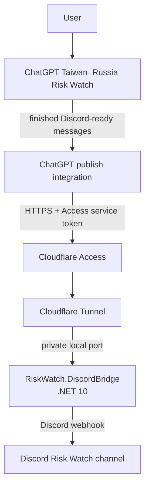

# Taiwan–Russia Risk Watch Discord Bridge

Status: Planned
Purpose: Record the approved self-hosted publishing bridge that sends completed ChatGPT-generated Taiwan–Russia 2027–2030 Risk Watch updates to Discord.
Depends on: Existing Ubuntu Docker host, Cloudflare-managed `pirocorp.com`, Discord channel webhook, ChatGPT integration capable of authenticated HTTPS calls
Related docs: [Roadmaps index](../README.md), [Docker and Portainer](../../platform/docker-and-portainer.md), [Networking and reverse proxy](../../platform/networking-and-reverse-proxy.md), [Services index](../../services/README.md)

## Locked Decision Record and AI Implementation Brief

**Status:** Approved concept; implementation not yet started  
**Version:** 1.0  
**Date:** 2026-10-02

## 1. Purpose

This project removes the manual copy/paste step between the existing Taiwan–Russia 2027–2030 Risk Watch workflow in ChatGPT and Discord.

ChatGPT remains responsible for producing the final Discord-ready Risk Watch messages. The self-hosted application is only a transport and publishing bridge. A future implementation agent must treat the decisions marked **LOCKED** as requirements rather than redesign suggestions.

Target flow:

```text
User
  -> ChatGPT Taiwan–Russia Risk Watch
  -> finished Discord-ready message blocks
  -> authenticated HTTPS call
  -> Cloudflare Access
  -> Cloudflare Tunnel
  -> self-hosted .NET bridge
  -> Discord webhook
  -> Risk Watch Discord channel
```

## 2. Scope boundary

### In scope

- C# / .NET 10.
- ASP.NET Core Minimal API.
- Docker deployment on the existing Ubuntu homelab host.
- One publish endpoint for already-formatted Risk Watch messages.
- Cloudflare Tunnel for internet reachability while the homelab remains behind NAT.
- Cloudflare Access as the external authorization boundary.
- Dedicated Cloudflare Access Service Token for the ChatGPT integration.
- Discord incoming webhook for final delivery.
- Ordered multi-message publishing.
- Message-size validation.
- Health check.
- Structured logging without secrets.
- Bounded retry handling for temporary Discord delivery failures.

### Out of scope

- FeedCord.
- RSS or OSINT collection.
- Autonomous research.
- Scenario scoring or confidence calculations.
- SQL or another persistent model database.
- Historical Risk Watch state.
- Automatic daily scheduling.
- General-purpose Discord bot functionality.
- Replacing the existing ChatGPT Risk Watch analysis workflow.

## 3. Locked high-level architecture



### LOCKED decisions

1. ChatGPT remains the analysis and formatting layer for phase 1.
2. The bridge must not modify, summarize, rescore, reorder, or reinterpret Risk Watch content.
3. The bridge is implemented in C# / .NET 10 as an ASP.NET Core Minimal API.
4. The bridge runs as a Dockerized self-hosted service on the existing Ubuntu homelab host.
5. The planned public hostname is `https://riskwatch.pirocorp.com`.
6. The planned local application port is `8080`; it must not be exposed directly to the public internet.
7. Public reachability uses Cloudflare Tunnel.
8. No router port forward is required for this service.
9. Cloudflare Access protects the public hostname.
10. ChatGPT authenticates with a dedicated Cloudflare Access Service Token.
11. The Discord webhook URL remains known only to the bridge.
12. The bridge publishes message blocks sequentially and preserves their original boundaries.
13. Nginx Proxy Manager is not required in the request path for this project.
14. FeedCord, automated OSINT ingestion, autonomous scoring, persistent model state, and scheduling are separate future projects.

## 4. Network model

The homelab remains behind NAT.

`cloudflared` initiates and maintains the tunnel from the homelab toward Cloudflare. External HTTPS requests are accepted by Cloudflare and delivered through that established tunnel to the local application.

Therefore:

- from the application perspective, the bridge receives inbound requests;
- from the router/firewall perspective, no new public inbound listener or port forward is required.

Planned route:

```text
https://riskwatch.pirocorp.com
        |
        v
Cloudflare Access
        |
        v
Cloudflare Tunnel
        |
        v
RiskWatch.DiscordBridge:8080
```

The exact Docker-network target may be resolved during implementation, but public exposure of `:8080` is not permitted.

## 5. Components and responsibilities

| Component | Responsibility | Must not become |
| --- | --- | --- |
| ChatGPT Risk Watch workflow | Produce the final Discord-ready Risk Watch blocks | A transport proxy or secret store |
| ChatGPT publish integration | Send the completed message array to the bridge | The Risk Watch analysis engine |
| Cloudflare Access | Enforce service-to-service authorization | The Discord publisher |
| Cloudflare Tunnel | Carry HTTPS traffic to the NATed homelab without router forwarding | A content-processing layer |
| RiskWatch.DiscordBridge | Validate and publish supplied messages in order | An OSINT collector or scoring engine |
| Discord webhook | Deliver messages into the selected Discord channel | A general-purpose Discord bot |

## 6. API contract

The phase-1 API exposes one conceptual operation:

```text
POST /api/riskwatch/publish
Content-Type: application/json
```

Request shape:

```json
{
  "messages": [
    "[1/4] ...",
    "[2/4] ...",
    "[3/4] ...",
    "[4/4] ..."
  ]
}
```

The bridge must:

1. validate that the request contains at least one message;
2. validate each message against the Discord message-size constraint used by the Risk Watch workflow;
3. keep message order unchanged;
4. keep message boundaries unchanged;
5. publish the messages sequentially;
6. return a clear success/failure result.

The exact DTO names, controller/minimal-route implementation, and response schema are implementation details.

## 7. Risk Watch formatting boundary

ChatGPT continues to own the existing Discord-ready formatting rules:

- sequential `[1/N]`, `[2/N]`, ... labels;
- scenario sections first;
- legend last;
- logical sections kept intact;
- each message kept safely below Discord's message-length limit.

The bridge must reject an invalid oversized message rather than silently splitting it into different logical blocks.

## 8. Authentication and secret boundaries

Cloudflare Access is the outer authorization layer.

The ChatGPT integration must supply the dedicated Cloudflare Access Service Token credentials accepted by the Access policy.

Secrets must not be committed to Git:

- Cloudflare Access Service Token credentials;
- Cloudflare Tunnel credentials/token;
- Discord webhook URL.

The Discord webhook URL remains inside the self-hosted bridge configuration and is never returned to ChatGPT.

Logs must not contain:

- Cloudflare client secrets;
- tunnel credentials;
- Discord webhook URLs;
- complete authorization headers.

## 9. Delivery and failure behavior

Messages are delivered in array order.

For temporary Discord failures, the bridge should use a bounded retry policy. It must not retry indefinitely.

If a message still fails after retries:

- stop the current publish operation;
- return failure;
- report the failed message index;
- report how many earlier blocks were successfully sent;
- do not log message-delivery secrets.

A persistent database-backed queue is intentionally excluded from the first implementation.

## 10. Implementation order

Implementation is intentionally incremental.

1. Create the .NET 10 Minimal API project.
2. Implement the publish request model and validation.
3. Implement the Discord webhook client.
4. Implement ordered sequential publishing.
5. Add the health endpoint and structured logging.
6. Containerize the application.
7. Deploy it under the existing homelab Docker layout.
8. Validate local publishing against a test Discord channel.
9. Create the Cloudflare Tunnel route for `riskwatch.pirocorp.com`.
10. Protect the hostname with Cloudflare Access.
11. Create a dedicated Access Service Token.
12. Validate that unauthenticated requests are blocked.
13. Configure the ChatGPT publish integration.
14. Send one real multi-block Risk Watch update end to end.
15. Document the deployed state and operating procedure.

## 11. Validation targets

The implementation must prove:

- the bridge runs successfully in Docker;
- the local health check is usable by Docker;
- `riskwatch.pirocorp.com` reaches the bridge only through Cloudflare Tunnel;
- the home router has no new port-forward rule for the bridge;
- requests without valid Cloudflare Access credentials are rejected;
- valid service-token requests reach the application;
- the Discord webhook secret never needs to be supplied to ChatGPT;
- all Risk Watch blocks arrive in the intended Discord channel;
- block ordering is preserved;
- block boundaries are preserved;
- the normal workflow no longer requires manual copy/paste.

## 12. Acceptance criteria

- [ ] .NET 10 bridge runs as a Dockerized self-hosted service.
- [ ] No router port forward is required.
- [ ] `https://riskwatch.pirocorp.com` is routed through Cloudflare Tunnel.
- [ ] Cloudflare Access blocks unauthenticated requests.
- [ ] ChatGPT integration authenticates with a dedicated Cloudflare Access Service Token.
- [ ] Discord webhook remains private to the bridge.
- [ ] Publish endpoint accepts multiple preformatted Risk Watch messages.
- [ ] Messages are sent sequentially in the supplied order.
- [ ] Message boundaries are unchanged.
- [ ] Oversized/invalid messages are rejected instead of silently reformatted.
- [ ] Temporary Discord failures use bounded retry behavior.
- [ ] A real Taiwan–Russia Risk Watch update is published end to end without manual copy/paste.

## 13. Deferred future work

Only after the publishing bridge is proven useful should separate follow-up projects consider:

- automatic daily invocation;
- FeedCord or other collectors;
- OSINT ingestion;
- article/evidence extraction;
- persistent evidence/model storage;
- autonomous scenario scoring;
- automatic comparison against historical snapshots.

These are not phase-1 bridge requirements and must not be added implicitly.

## 14. Post-implementation documentation transition

After deployment is validated:

1. create a service runbook under `docs/services/riskwatch-discord-bridge/README.md`;
2. add the service to the implemented service inventory and services index;
3. record the actual Docker stack path, container name, image/version, local port, health endpoint, and secret strategy;
4. record the Cloudflare Tunnel and Access configuration at an operational level without committing secrets;
5. move the project from Planned to Implemented in the root documentation;
6. retain this roadmap as the architecture decision record.

## 15. Implementation guardrail

Do not expand this roadmap into a general Risk Watch automation platform during phase 1.

The first implementation succeeds when the existing ChatGPT-generated Discord-ready update can be published securely to Discord through the self-hosted bridge while the homelab remains behind NAT.
