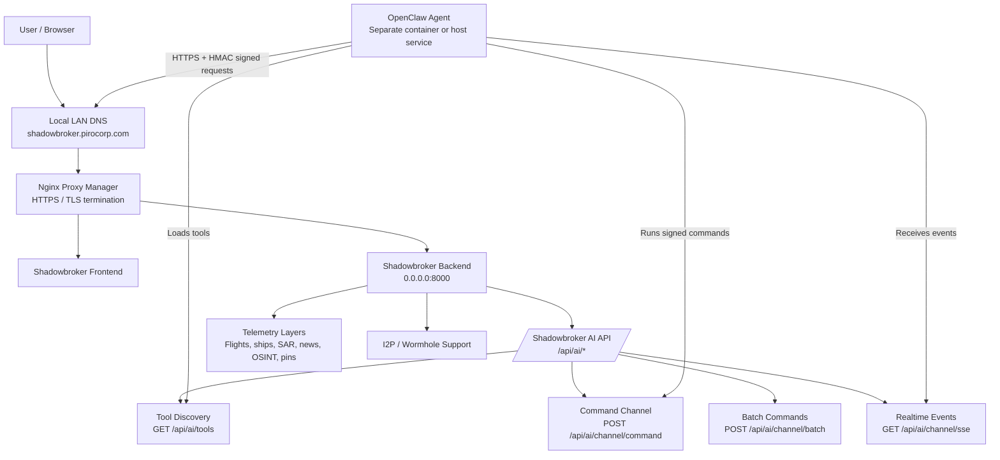
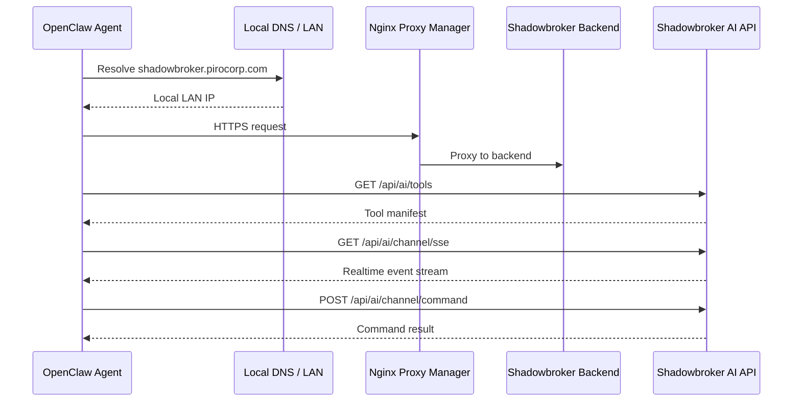

# Shadowbroker + OpenClaw Integration Architecture

## Objective

The goal is to integrate an OpenClaw AI agent with a self-hosted Shadowbroker intelligence platform, allowing OpenClaw to operate as an external AI reasoning layer with authenticated access to Shadowbroker telemetry, tools, and command interfaces.

Shadowbroker remains the central intelligence and telemetry system. OpenClaw acts as an autonomous AI agent that can query, analyze, and interact with Shadowbroker through the official AI API.

---

## Target Architecture



---

## Components

### Shadowbroker

Shadowbroker provides:

- Intelligence data storage
- Telemetry layers
- Map visualization
- AI command interface
- Real-time event streaming
- Tool discovery API

Main endpoints:

```text
GET  /api/ai/tools
POST /api/ai/channel/command
POST /api/ai/channel/batch
GET  /api/ai/channel/sse
```

The backend has been confirmed to listen on:

```text
0.0.0.0:8000
```

This means it is reachable from Docker networking and from Nginx Proxy Manager.

---

### Nginx Proxy Manager

NPM provides the internal HTTPS endpoint:

```text
https://shadowbroker.pirocorp.com
```

This hostname is intended for the local network, not public internet exposure.

NPM provides:

- TLS termination
- Stable local service address
- Reverse proxy routing
- Local HTTPS access for OpenClaw and browsers

Recommended NPM advanced settings for the SSE endpoint:

```nginx
proxy_buffering off;
proxy_cache off;
proxy_read_timeout 3600s;
```

---

### OpenClaw Agent

OpenClaw runs independently from Shadowbroker.

It does not need to share:

- The same Docker Compose file
- The same container namespace
- Host ports
- The Shadowbroker Docker network, if it can resolve and reach `shadowbroker.pirocorp.com`

Recommended OpenClaw environment:

```env
SHADOWBROKER_URL=https://shadowbroker.pirocorp.com
SHADOWBROKER_HMAC_SECRET=<shadowbroker-full-access-secret>
SHADOWBROKER_ACCESS=full
```

Do not configure:

```env
SHADOWBROKER_URL=https://shadowbroker.pirocorp.com/api/ai/tools
```

The URL should be the base Shadowbroker URL only. OpenClaw will append API paths itself.

---

## Authentication Model

Shadowbroker does not rely on IP-based trust.

Access is controlled using HMAC-SHA256 signing.

The shared secret:

```env
SHADOWBROKER_HMAC_SECRET=<secret>
```

is used by OpenClaw to sign requests.

Protected requests use:

```text
X-SB-Timestamp
X-SB-Nonce
X-SB-Signature
```

Signature format:

```text
HMAC(secret, METHOD|path|timestamp|nonce|sha256(body))
```

This allows OpenClaw to authenticate securely even when it runs outside the Shadowbroker container.

---

## Access Levels

### Restricted Access

```env
SHADOWBROKER_ACCESS=restricted
```

Allows read-focused operations such as:

- Telemetry queries
- Searches
- Analysis
- Reports
- Layer discovery

### Full Access

```env
SHADOWBROKER_ACCESS=full
```

Allows write-capable operations such as:

- Placing pins
- Creating layers
- Injecting data
- Setting watches
- Triggering displays
- Performing map/system actions

Write operations should only be used intentionally.

---

## Smoke Tests Completed

### 1. Internal Docker Reachability

Command:

```bash
docker run --rm --network shadowbroker_default curlimages/curl \
  http://shadowbroker-backend:8000/api/ai/tools
```

Observed result:

```json
{"detail":"Forbidden — authentication required"}
```

Meaning:

- Docker DNS works
- Container networking works
- Shadowbroker backend is reachable
- Authentication protection is active

---

### 2. Reverse Proxy Reachability

Command:

```bash
curl -i https://shadowbroker.pirocorp.com/api/ai/tools
```

Observed result:

```text
HTTP/2 200
content-type: application/json
```

The response includes:

```json
{
  "ok": true,
  "version": "0.9.82",
  "access_tier": "restricted",
  "available_commands": [...]
}
```

Meaning:

- Local DNS works
- NPM works
- HTTPS works
- Shadowbroker AI tool discovery works

---

### 3. Command Endpoint Exists

Command:

```bash
curl -i https://shadowbroker.pirocorp.com/api/ai/channel/command
```

Observed result:

```text
HTTP/2 405
allow: POST
```

Meaning:

- The command endpoint exists
- It correctly rejects GET
- It expects authenticated POST requests

---

### 4. Backend Root Response

Command:

```bash
docker run --rm --network shadowbroker_default curlimages/curl \
  -I http://shadowbroker-backend:8000/
```

Observed result:

```text
HTTP/1.1 404 Not Found
server: uvicorn
```

Meaning:

- Docker DNS works
- Uvicorn is responding
- `/` is simply not a defined backend route

---

## Final Target Flow



---

## Expected Result

OpenClaw becomes a trusted AI operator connected to Shadowbroker.

The agent can:

- Discover telemetry layers
- Search intelligence data
- Analyze events
- Monitor changes
- Interact with maps
- Create intelligence objects
- Automate investigations

Shadowbroker remains:

- Self-hosted
- Protected behind LAN HTTPS
- Authenticated with HMAC
- Not dependent on public internet exposure
- Isolated from unauthenticated access

The final system provides a private AI-powered intelligence platform where Shadowbroker supplies live data and OpenClaw supplies autonomous reasoning.

---

## Current Conclusion

The network and reverse proxy path are confirmed working.

The remaining critical requirement is that OpenClaw must use the correct Shadowbroker HMAC secret and access level.

Final OpenClaw configuration should use:

```env
SHADOWBROKER_URL=https://shadowbroker.pirocorp.com
SHADOWBROKER_HMAC_SECRET=<full-access-secret>
SHADOWBROKER_ACCESS=full
```
